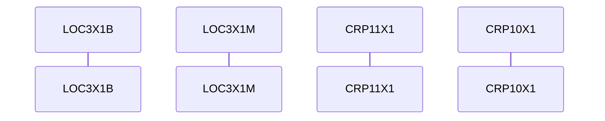

# BPEL Analysis

**Generated:** 2025-10-24T19:15:07.538238
**Source:** `sample/LocationRetrievalLOC3X1Process.bpel`

## Process

- **Name:** `LocationRetrievalLOC3X1BProcess`
- **Target Namespace:** `http://LocationServices`

## Partner Links

- `LocationRetrievalLOC3X1B` (type: ns3:LocationRetrievalLOC3X1B, myRole: , partnerRole: )

## Inbound Operations

### GetLocationWithTaxingJurisdictions3X1B

- **PartnerLink:** `LocationRetrievalLOC3X1B`
- **PortType:** `ns3:LocationRetrievalLOC3X1B`
- **Fault Replies:**
  - Reply fault `ns3:SimpleFaultReply` on op `GetLocationWithTaxingJurisdictions3X1B`

#### Sequence Diagram

