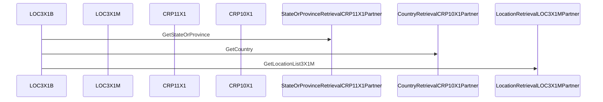
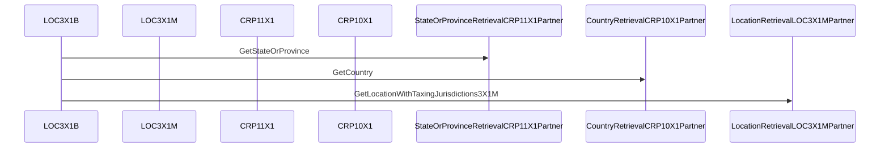

# BPEL Analysis

**Generated:** 2025-10-26T17:10:14.090075
**Source:** `sample/LocationRetrievalLOC3X1Process.bpel`

## Process

- **Name:** `LocationRetrievalLOC3X1Process`
- **Target Namespace:** `http://LocationServices`

## Partner Links

- `LocationRetrievalLOC3X1B` (type: ns:LocationRetrievalLOC3X1BPLT, myRole: Interface, partnerRole: )
- `LocationRetrievalLOC3X1MPartner` (type: ns:LocationRetrievalLOC3X1MPLT, myRole: , partnerRole: Interface)
- `StateOrProvinceRetrievalCRP11X1Partner` (type: ns:StateOrProvinceRetrievalCRP11X1PLT, myRole: , partnerRole: Interface)
- `CountryRetrievalCRP10X1Partner` (type: ns:CountryRetrievalCRP10X1PLT, myRole: , partnerRole: Interface)

## Inbound Operations

### GetLocationList3X1B

- **PartnerLink:** `LocationRetrievalLOC3X1B`
- **PortType:** `ns3:LocationRetrievalLOC3X1B`
- **Invocation Order:**
  - StateOrProvinceRetrievalCRP11X1Partner -> `GetStateOrProvince`
  - CountryRetrievalCRP10X1Partner -> `GetCountry`
  - LocationRetrievalLOC3X1MPartner -> `GetLocationList3X1M`
- **Fault Replies:**
  - Reply fault `ns3:SimpleFaultReply` on op `GetLocationList3X1B`
  - Reply fault `ns3:SimpleFaultReply` on op `GetLocationList3X1B`
  - Reply fault `ns3:SimpleFaultReply` on op `GetLocationList3X1B`
  - Reply fault `ns3:SimpleFaultReply` on op `GetLocationList3X1B`
  - Reply fault `ns3:SimpleFaultReply` on op `GetLocationList3X1B`

#### Sequence Diagram

### GetLocationWithTaxingJurisdictions3X1B

- **PartnerLink:** `LocationRetrievalLOC3X1B`
- **PortType:** `ns3:LocationRetrievalLOC3X1B`
- **Invocation Order:**
  - StateOrProvinceRetrievalCRP11X1Partner -> `GetStateOrProvince`
  - CountryRetrievalCRP10X1Partner -> `GetCountry`
  - LocationRetrievalLOC3X1MPartner -> `GetLocationWithTaxingJurisdictions3X1M`
- **Fault Replies:**
  - Reply fault `ns3:SimpleFaultReply` on op `GetLocationWithTaxingJurisdictions3X1B`
  - Reply fault `ns3:SimpleFaultReply` on op `GetLocationWithTaxingJurisdictions3X1B`
  - Reply fault `ns3:SimpleFaultReply` on op `GetLocationWithTaxingJurisdictions3X1B`
  - Reply fault `ns3:SimpleFaultReply` on op `GetLocationWithTaxingJurisdictions3X1B`
  - Reply fault `ns3:SimpleFaultReply` on op `GetLocationWithTaxingJurisdictions3X1B`

#### Sequence Diagram

